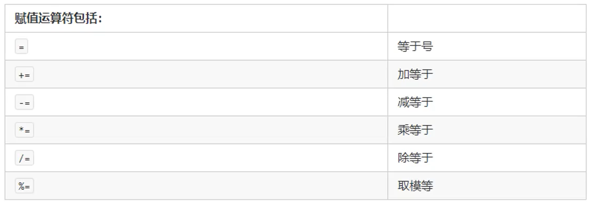

# Java - 成长体系

## DEMO-2 计算机基础知识

### 1、进制

- 二进制

  计算机中的数据不同于人们生活中的数据计算，计算机中全部采用**二进制**数表示，它只包含0、1两个数，逢二进一。

  例如：1+1=10;

  注意：每一个0或者每一个1叫做一个bit(比特，位)

  二进制计算：

  - 二进制转十进制，以及十进制转二进制

    

### 2、字节（byte）

- 字节是计算机当中最小的存储单元。计算机存储任何的数据，都是以字节的形式存储
  - 8 bit（比特，位） = 1byte（字节）=1B
  - 1024 B = 1 KB
  - 1024 KB = 1 MB
  - 1024 MB = 1GB
  - 1024 GB = 1 TB

### 3、Windos命令提示符

- 启动：Win+R
- 切换盘符：盘符名称: 例如D:
- 进入文件夹：cd 文件夹名称
- 进入多级文件夹：cd 文件夹名称\文件夹名称1\文件夹名称2
- 返回上一级：cd..
- 直接回根路径：cd \
- 查看当前文件内容：dir
- 清屏：cls
- 退出：exit

## DEMO-3 Java 开发环境搭建

### 1、Java虚拟机 - JVM

- JVM（Java Virtual Machise）:jack_o_lantern:Java虚拟机，简称JVM，是运行所有Java程序的假想计算机，是Java程序运行环境，是Java最具吸引力的特性之一。
- 跨平台：不区分操作系统，一次编写多平台（操作系统）运行

### 2、JRE与JDK

#### 2.1-JRE

- JRE（Java Runtime Environment）是Java程序的运行时环境，包含JVM和运行时所需要的核心类库

#### 2.2-JDK

- JDK（Java Development kit）是Java程序的开发工具包，包含JRE和开发人员使用的工具

#### 2.3-关系图


## DEMO-4 Java开发规则

### 1、标识符

- 指在程序中，开发人员自定义的内容。比如类的名字、方法名字以及变量名字等等，都是标识符

### 2、名命规则

- 标识符可以包含:black_square_button:英文字母26个（区分大小写）、0-9数字、$ (美元符号)以及 _下划线
- 标识符不能以数字开头
- 标识符不能是关键字

### 3、命名规范（驼峰命名）

- 类名规范：首字母大写，后面每个单词首字母大写（大驼峰）
- 变量命名：首字母小写，后面每个单词首字母大写（小驼峰）
- 方法名：同变量名
- 建议：命名应起到**见名知意**的效果，比如：教师类 应取名为 Teacher

## DEMO-5 Java 常量

### 1、概述

- 常量是指 Java 程序运行期间 **固定不变的量**（数据）

### 2、常量分类

|    类型    | 含义                                            | 数据列举               |
| :--------: | ----------------------------------------------- | ---------------------- |
|  整数常量  | 所有的整数                                      | 0，1，2，3，999，-20   |
|  小数常量  | 所有的小数                                      | 0.0，0.1，2.5，-2.3    |
|  字符常量  | 单引号包起来的，只能写一个字符，必须有内容      | ‘H’，'L'，'好'         |
| 字符串常量 | 双引号包起来的，可以写多个字符，也可以不写      | "A"，"B"，"CC"，"你好" |
|  布尔常量  | 只有两个值，真或假(程序中用 true 或 false 表示) | true , false           |
|   空常量   | 只有一个值                                      | null                   |

### 3、常量demo

```java
/**
 * 程序输出各类型常量
 */
public class demoConst{
    public static void main(String[] args) {
        System.out.println(1)  	   // 整数常量 -> 输出：1
        System.out.println(1.1)    // 小数常量 -> 输出：1.1
        System.out.println('A')    // 字符常量 -> 输出：A
        System.out.println("ABC")  // 字符串常量 -> 输出：ABC
        System.out.println(true)   // 布尔常量 -> 输出：true
        System.out.println(false)  // 布尔常量 -> 输出：false
        System.out.println(null)   // 空常量 -> 编译报错，不能输出空常量
    }
}
```

## DEMO-6 java 数据类型

### 1、数据类型分类

- 基本数据类型：整型(byte short int long) 、浮点型（float double）、字符型（char）、布尔型（boolean）
- 引用数据类型：类、数组、接口、
- 注意：
  - 字符串不是基本数据类型，而是引用类型
  - 浮点型可能只是一个近似值，并非精确的值
  - 数据范围与字节数不一定相关，例如 float 的数据范围比 long 更加广泛，但是 float 是4字节，long为8字节 
  - 浮点数当中默认类型是double。如需使用float,须在数据后面加上F 。例如：3.14F （推荐大写F）
  - 如果是整数，默认为 int 类型，如需使用long 则需在数据后面加上L。例如：3L（推荐大写，小写容易与数字1混淆，不易阅读代码）

### 2、基本数据类型

- 四类八种基本数据类型

  

## DEMO-7 Java 变量

### 1、变量概述

- 变量：常量是固定不变的数据，那么在程序中可以变化的量称为变量（可变的量）
- Java 中要求一个变量每次只能保存一个数据，必须要明确保存的数据类型

### 2、变量的定义与注意事项

- 变量的定义

  - 不赋值定义： 数据类型 变量名

  - ```java
    int num;
    ```

  - 赋值定义：数据类型 变量名 = 值

  - ```java
    int num = 10;
    ```

  - 同时定义多个变量 数据类型 变量名，变量名，变量名...;

  - ```java
    int a,b,c;
    ```

  - 同时定义多个变量并赋值

  - ```java
    int a = 10,b = 20,c = 30;
    ```

- 注意事项
  - 如果创建多个变量，那么变量之间的名称不可重复
  - 对于float 与 long类型的变量，后缀F和L都不能去掉
  - 如果使用byte 或者short 类型的变量，那么变量值的取值范围不能超过类型的取值范围
  - 没有赋值的变量，不能直接使用g，一定要赋值之后才能使用
  - 变量使用不能超过作用域的范围
    - 作用域：从定义变量的一行开始，一直到所属片段的大括号结束为止

## DEMO-8 数据类型转换

### 1、自动类型转换（隐式转换）

-  特点：代码不需要进行特殊处理，自动完成

- 规则：数据范围从小到大

- ```java
  // 式例：将 int 类型常量值 赋值给 long 类型变量 
  // 由于 long 类型的取值范围比 int 类型的取值范围大 所以就发生了自动类型转换
  long num = 100;
  ```

### 2、强制类型转换（显式转换）

- 特点：代码需要进行格式处理，不能自动完成

- 处理格式：范围小的类型 范围小的变量名 = （范围小的类型）原本范围大的数据;

- ```java
  // 例如: 将 long 类型的数据赋值给 int
  int num = (int)100L;
  ```

### 3、注意事项

- 强制类型转换一般不推荐使用，因为有可能发生精度损失，数据溢出

  - ```java
    // 例如：将 long 强转成 int
    int num = (int)6000000000L;
    System.out.println(num) // 输出：1705032704  数据明显不是我们想要的结果
    ```

  - 数据溢出式例

- byte、short、char这三种类型都可以发生数学运算，例如加法"+"

- byte、short、char这三种类型运算的时候，都会被首先提升成为 int 类型然后在进行运算 

- boolean 类型不能发生数据类型转换

## DEMO-9 ASCII码表

### 1、ASCII码表

- ASCII码表 （American Standard  Code for Information InterCahnge）
- 三个关键码 
  - 48  --->   0
  - 65  --->   A
  - 97  --->   a

## DEMO-10 运算符

### 1、算数运算符


- `注意事项：`

  - `一旦运算当中数据类型不同，那么结果将会是数据类型大的那种。`

  - `对于数值来说` `+`  `就是加法`

  - `对于` `char` `类型来说，在计算之前，char类型会被提升成为int 然后在计算，char 与 int 之间的运算关系对照ASCII 与 Unicode 码表 `

  - `对于字符串来说的话，由于字符串是引用类型 用` `+` `进行运算的话 则是拼接的效果,而结果则是字符串类型`

    ```java
    // 例如：
    System.out.println("hello" + 3) // 输出 hello3
    ```

  - `自增 与 自减`

    - `++num 或者 --num 先加后用`

    - `num++ 或者 num-- 先用后加 `

    - ```java
      // 例如 前自增与后自增 自减一致效果
      int num = 10;
      System.out.println(++num); // 输出：11;
      System.out.println(num++); // 输出：11;
      System.out.println(num);   // 输出：12;
      ```

### 2、赋值运算符



- `注意事项:`
  - `只有变量才能使用赋值运算符，常量不能进行赋值`
  - `当类型不同时，使用复合赋值运算符会进行一个隐式强制类型转换。`

### 3、比较运算符


- 比较运算符是两个数据之间进行比较运算，运算结果都是布尔值 `true` 或者 `false`

### 4、逻辑运算符

| 逻辑运算符   | 说明                                                         |
| ------------ | ------------------------------------------------------------ |
| 逻辑与 `&`   | 两个操作数为 `true` 结果才为 `true` , 否则为 `false`         |
| 逻辑或 `|`   | 两个操作数其中有一个为 `true` 结果则为 `true` , 否则为 `false` |
| 逻辑非 `!`   | 针对单个操作数取反 当为 `true` 时 结果 为 `false` ，反之亦然 |
| 逻辑异或 `^` | 两个操作数不管 `true` 还是 `false` 只要结果相同 则为 `false` 不同 则为 `true` |
| 短路与 `&&`  | 与逻辑与意思一致                                             |
| 短路或 `||`  | 与逻辑或意思一致                                             |

- 短路 与 逻辑的区别（包括 `短路与 &&`、`逻辑与 &`、`短路或 ||`、`逻辑或 |`)：

  - **短路与 ** 见名知意，在进行运算时如第一个操作数不成立则直接返回结果，后面操作数不在进行运算，从而提高效率。而 **逻辑与** 则反之，每一个操作数都进行运算在返回结果。

  - ```java
    // 短路与逻辑的区别：
    boolean b = 1 < 0 & 1 < (3 / 0);	// 逻辑与 &
    System.out.println(b);				// 输出：程序异常 整型0不能做被除数
    
    boolean b = 1 < 0 && 1 < (3 / 0);	// 短路与 &&
    System.out.println(b);				// 输出：false
    ```

### 5、位运算符

| 位运算符     | 说明                                                         |
| ------------ | ------------------------------------------------------------ |
| 取反 `~`     | 针对单个操作数按二进制位进行取反 例如：3的二进制码为：0011 则结果为 1100 |
| 按位与 `&`   | 二进制位按位与                                               |
| 按位或 `|`   | 二进制位按位或                                               |
| 按位异或 `^` | 二进制位按位异或                                             |
| 左位移 `<<`  | 左移 1 位相当于 **乘 **2                                     |
| 右位移 `>>`  | 右移 1 位相当于 **除** 2 **取商**                            |

